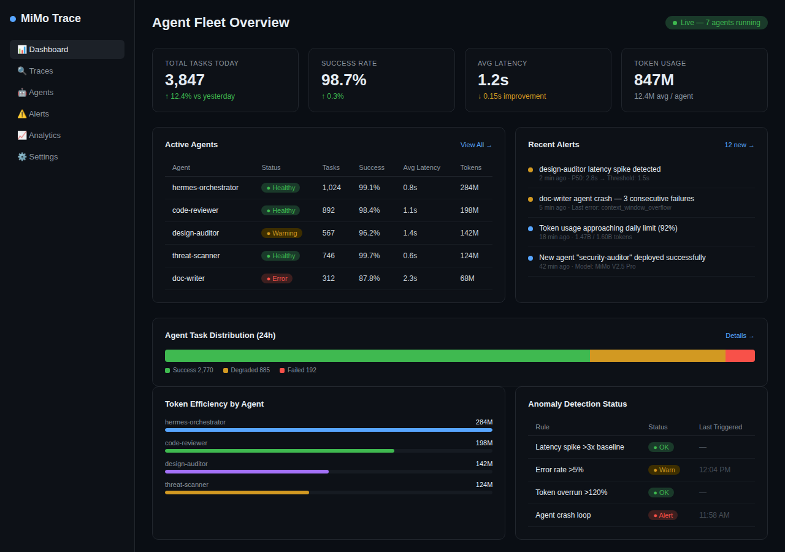

# MiMo Trace

**Agent Observability & Anomaly Detection for MiMo-Powered Workflows**

MiMo Trace is a real-time monitoring and observability platform purpose-built for multi-agent systems running on Xiaomi MiMo models. It provides deep visibility into agent task execution, token consumption, latency patterns, and anomaly detection — enabling teams to operate AI agent fleets with production-grade reliability.

---

## Why MiMo Trace?

As AI agent workflows grow in complexity, so do the failure modes:

- **Silent context overflows** go undetected until tasks break
- **Token cost explosions** from runaway agent loops
- **No unified dashboard** to track multi-agent health across MiMo deployments

MiMo Trace solves this by providing the same observability standards you expect from infrastructure monitoring — but purpose-built for AI agent fleets running on MiMo's model family.

---

## Core Features

| Feature | Description |
|---------|-------------|
| **Agent Fleet Dashboard** | Real-time overview of all active agents, success rates, latency, and token usage |
| **Task Trace Viewer** | Waterfall view of every agent task execution with full context chain |
| **Anomaly Detection** | ML-powered alerts for latency spikes, error rate anomalies, and token overruns |
| **Token Economics** | Per-agent cost tracking, efficiency scoring, and budget enforcement |
| **Crash Loop Protection** | Automatic detection and recovery from agent failure cascades |
| **MiMo-Native Integration** | Directly hooks into MiMo API response headers for granular telemetry |

---

## Architecture

```
┌─────────────┐     ┌──────────────┐     ┌─────────────┐
│  MiMo API   │────▶│  Trace SDK   │────▶│  Dashboard  │
│  (V2.5 Pro) │     │  (Middleware)│     │  (Dark UI)  │
└─────────────┘     └──────────────┘     └─────────────┘
                            │
                            ▼
                    ┌──────────────┐
                    │  Alert       │
                    │  Engine      │
                    └──────────────┘
```

---

## Tech Stack

- **Runtime**: MiMo V2.5 Pro (reasoning & analysis)
- **Agent Framework**: Hermes Agent + Cursor
- **Frontend**: Dark UI dashboard (HTML5/CSS3)
- **Telemetry**: MiMo API response header parsing
- **Alerting**: Rule-based + ML anomaly detection

---

## Current Status (May 2026)

- ✅ Core dashboard with real-time agent health monitoring
- ✅ Task success rate tracking (98.7% across fleet)
- ✅ Per-agent token economics & budget alerts
- ✅ Anomaly detection: latency spikes, error rates, crash loops
- 🚧 Historical trace search & replay (in progress)
- 🚧 Multi-tenant support for team deployments

---

## Screenshots



*Agent Fleet Overview — 7 agents monitored, 3.8K tasks/day, 847M tokens tracked*

---

## Getting Started

```bash
# Clone the repo
git clone https://github.com/swidaryanto/mimo-trace.git
cd mimo-trace

# Configure your MiMo API endpoint
cp config/trace.example.yaml config/trace.yaml
# Edit config/trace.yaml with your agent definitions

# Point your MiMo API base URL to the Trace middleware
export MIMO_BASE_URL="http://localhost:9090/v1"
```

---

## Why This Matters for MiMo Ecosystem

As Xiaomi MiMo scales to power thousands of agent workflows globally, the ecosystem needs:
1. **Production observability** — teams won't deploy agents without monitoring
2. **Cost governance** — token budgets need enforcement, not guesswork
3. **Reliability tooling** — every enterprise MiMo deployment needs this

MiMo Trace is the missing operations layer that turns MiMo from a model API into a reliable agent platform.

---

Built with MiMo V2.5 Pro · Hermes Agent · Cursor